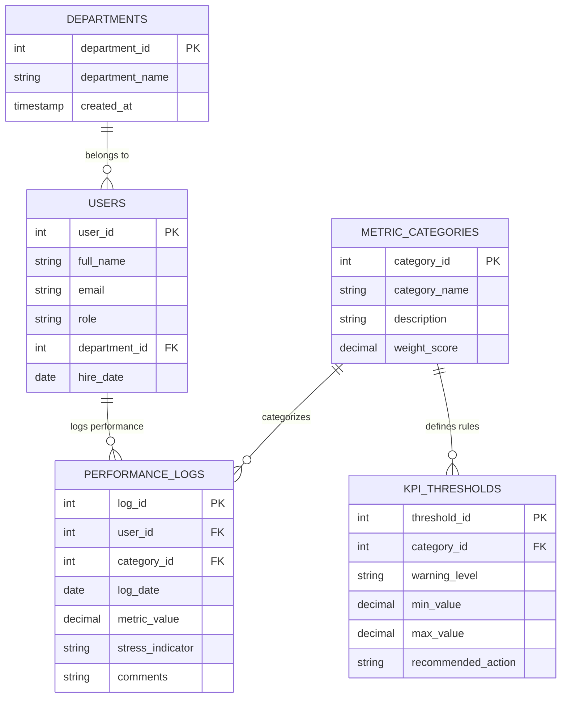

# Database Entity Relationship Diagram (ERD)

This diagram represents the relational structure of the Behavioral Analytics & Performance Decision Support System (B-DSS).

```mermaid
erDiagram
    DEPARTMENTS ||--o{ USERS : "belongs to"
    USERS ||--o{ PERFORMANCE_LOGS : "logs performance"
    METRIC_CATEGORIES ||--o{ PERFORMANCE_LOGS : "categorizes"
    METRIC_CATEGORIES ||--o{ KPI_THRESHOLDS : "defines rules"

    DEPARTMENTS {
        int department_id PK
        string department_name
        timestamp created_at
    }

    USERS {
        int user_id PK
        string full_name
        string email
        string role
        int department_id FK
        date hire_date
    }

    METRIC_CATEGORIES {
        int category_id PK
        string category_name
        string description
        decimal weight_score
    }

    PERFORMANCE_LOGS {
        int log_id PK
        int user_id FK
        int category_id FK
        date log_date
        decimal metric_value
        string stress_indicator
        string comments
    }

    KPI_THRESHOLDS {
        int threshold_id PK
        int category_id FK
        string warning_level
        decimal min_value
        decimal max_value
        string recommended_action
    }
```
